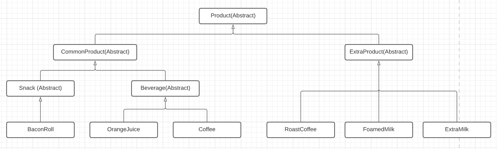
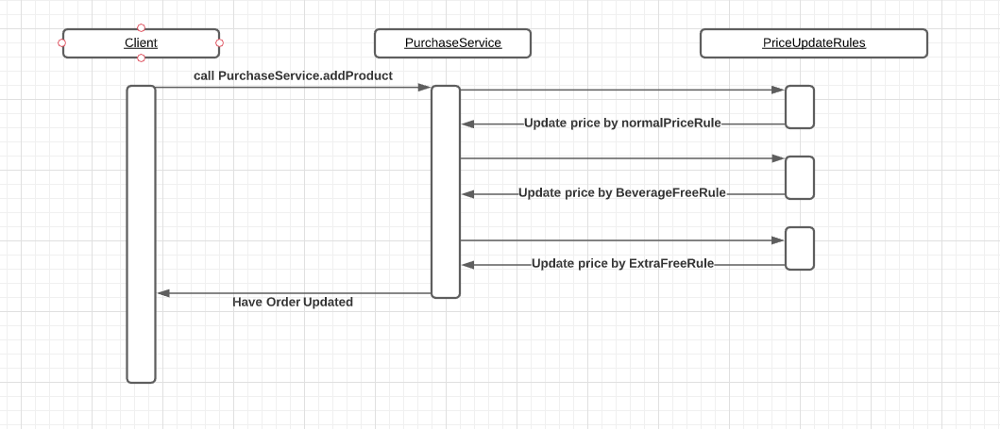

###Project introduce
1. The project source code structure is avail for import to main Java editor, e.g. Intellij and Eclipse
2. For fast check, you could go to project directory, and run 
```
   maven clean test
```
3. Main package introduce
```
   1. com.cognizant.coffee.item    This package having Order and OrderEntry, one Order would have 0 to many OrderEntry class
   2. com.cognizant.coffee.product This package having all the product, below will have a clear picture stating their structure
   3. com.cognizant.coffee.service This package contain PurchaseSerice, client programe would process Order by this class
   4. com.cognizant.coffee.rule    This package having all the updating rules, client programe no need to interact with this package 
```
4. API calling example. If I want to buy a Coffee, a free OrangeJuice, and a BaconRoll, then I can
````java
    @Test
    public void sample()
    {
        Order order = new Order();
        PurchaseService purchaseService = new PurchaseService();

        purchaseService.addProduct(order, new Coffee(Coffee.CoffeeType.LARGE));
        purchaseService.addProduct(order, new OrangeJuice(), true);
        purchaseService.addProduct(order, new BaconRoll());

        order.printInvoice();
    }
````
And this is the expected result
````
Large Coffee   .................  3.50 CHF
Orange Juice   .................  0.00 CHF
Bacon Roll     .................  4.50 CHF
..........................................
Total                             8.00 CHF
````


###Product Item structure
There are few items mentioned in the requirement, I create these items in hierarchy


###Service calling
As above sample code, if want to add product, then add the order with product by PurchaseService instance would be done, all the rules would be encapsulated by PurchaseService
